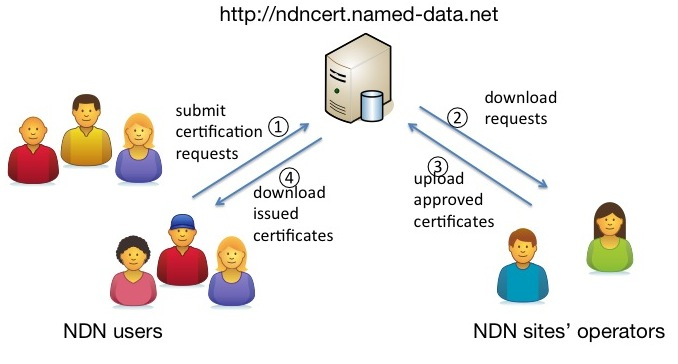
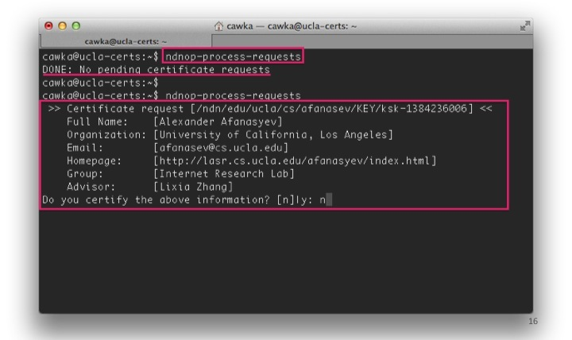

ndncert
=======

Utilities to facilitate public key certificate management on NDN Testbed.
The objective of the system is to simplify, yet keep secure, public key certification process.

ndncert consists of two components:

* `ndnop-process-requests` script to be run by NDN testbed site operators
  after receiving email notification of a submitted certification request.
* web server implementation in `www/` that receives certification requests from users,
  notifies site operators of pending certifications, and notifies users after certificate
  has been issued or denied.

## Name conventions for NDN certificates

ndncert directly ties the issued certificate names (= authorized namespace for the hierarchical
trust model described in NDN-0009, "Deploying Key Management on NDN Testbed" by Bian et al.)
to user email addresses.

In general, certificate namespace is based on institutional email addresses:

    tom@cs.ucla.edu -> /ndn/edu/ucla/cs/tom
    bob@wustl.edu -> /ndn/edu/wustl/bob
    alice@eecs.umich.edu -> /ndn/edu/umich/eecs/alice

Non-institutional addresses and addresses of institutions that are not part of testbed
assigned guest NDN namespace:

    alex@gmail.com -> /ndn/guest/alex@gmail.com

Which operator is responsible to signing certificates for which domain names is configured
in the web server database (`operators` collection).

## Basic operations

### User view

To obtain a valid NDN testbed certificate, user should follow the following steps:

* Go to http://ndncert.named-data.net, initiate certification by submitting email address

    

* Check mailbox and click to open certification submission page

    

* Generate certification request in the specified namespace (derived from email)

    

* Submit name, other information to associate with the certificate, and public key

    

* Wait for email notification of the approval by the site’s operator

    

* Follow the instructions to install the issued certificate

    

After final step the NDN Testbed certificate is installed and ready to be used.

### Site operator view

Whenever users submit certification requests, operators are getting notified via email. The
following highlights steps operators need to perform to issue or deny certification:

* Wait for notification about users’ certification request(s)

    

* Log in (ssh) to the certification host

    

* Run `ndnop-process-requests` command and make decisions to approve/reject request

    

    If `ndnop-process-requests` is missing, it can be downloaded using

        curl -O https://raw.githubusercontent.com/named-data/ndncert/master/ndnop-process-requests
        chmod 755 ndnop-process-requests

        # Optionally copy to a folder within $PATH. For example:
        sudo mv ndnop-process-requests /usr/local/bin/
